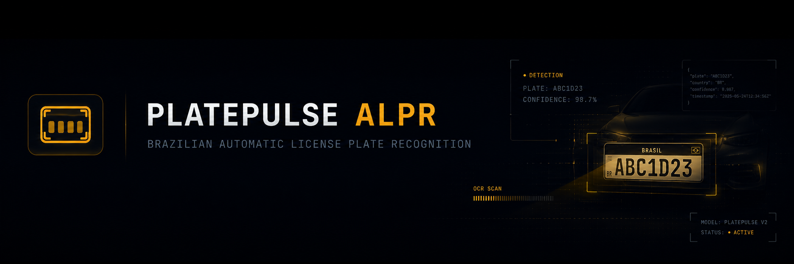
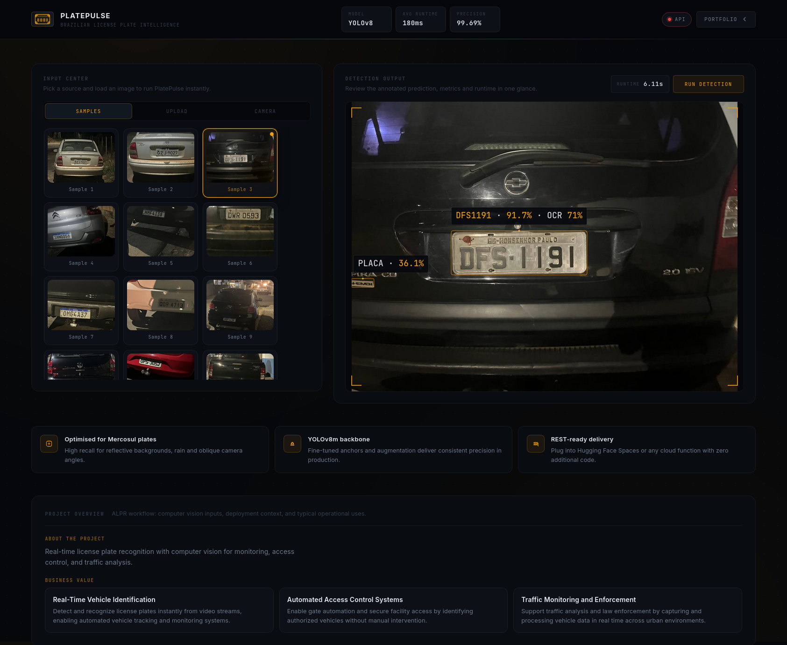

<!-- Canonical repository: https://github.com/sidnei-almeida/brazilian-alpr-system -->
<p align="center">
  
</p>

<h1 align="center">brazilian-alpr-system</h1>

<p align="center">
  <strong>YOLOv8 research stack for <em>plate character</em> detection (digits and letters)—the OCR-style stage of ALPR—not full license-plate bounding-box detection.</strong>
</p>

<p align="center">
  <a href="https://www.python.org/" title="Python"></a>
  &nbsp;&nbsp;&nbsp;
  <a href="https://pytorch.org/" title="PyTorch"></a>
  &nbsp;&nbsp;&nbsp;
  <a href="https://jupyter.org/" title="Jupyter"></a>
  &nbsp;&nbsp;&nbsp;
  <a href="https://www.ultralytics.com/" title="Ultralytics YOLO"></a>
</p>

<p align="center">
  
  
  
  
</p>

<p align="center">
  <a href="#scope-what-this-repo-is-not">Scope</a> ·
  <a href="#overview">Overview</a> ·
  <a href="#gallery">Gallery</a> ·
  <a href="#features">Features</a> ·
  <a href="#dataset">Dataset</a> ·
  <a href="#training--artifacts">Training</a> ·
  <a href="#results">Results</a> ·
  <a href="#reproducing-the-workflow">Reproduce</a> ·
  <a href="#project-layout">Layout</a> ·
  <a href="#limitations">Limitations</a> ·
  <a href="#author">Author</a>
</p>

---

## Scope: what this repo is **not**

| This repository | Separate project (not here) |
|-----------------|----------------------------|
| **Character-level** object detection: each bounding box is a **single digit or letter**(`0–9`, `A–Z`) on or near a plate crop. | **Plate localization**: finding the rectangular **plate region** in a full vehicle image. |
| Builds the **reading / OCR-style** slice of an ALPR pipeline (after you have crops or tight scenes). | End-to-end “find plate then read” unless you **compose** this model with a plate detector elsewhere. |

> If you need **only** “where is the plate in the frame?”, use your **plate-detection repository** and treat this repo as the **character recognition** companion.

---

## Overview

**brazilian-alpr-system** documents a full research pass from a **Roboflow** YOLO export to **Ultralytics YOLOv8n** training aimed at **Brazilian-style plate text** under noise, blur, and perspective. The detector outputs **36 classes** (alphanumeric symbols), suitable for **string assembly** (sorting boxes, Mercosul vs legacy rules) in a larger system.

| Layer | Detail |
|-------|--------|
| **Detector** | YOLOv8 **nano** (`yolov8n.pt`), `task=detect`. |
| **Notebook** | `Dataset_analysis_and_YOLO_Training.ipynb` — Colab-oriented EDA, Albumentations, stratified split, training, packaging. |
| **Run snapshot** | `license_plate_detection3/` — `weights/best.pt`, `results.csv`, `args.yaml`, curves, confusion matrices, batch visualizations. |

---

## Gallery

<p align="center">
  
</p>

<p align="center">
  <em><strong>Figure 1.</strong> Research workflow: annotated character boxes → YOLOv8 training → validation plots and <code>best.pt</code> (character stage only).</em>
</p>

---

## Features

| Area | Description |
|------|-------------|
| **Character detection** | 36 YOLO classes matching **plate symbols**, not a single “plate” class. |
| **Reproducible notebook** | Download → inspect labels → augment → split → train → export artifacts. |
| **Metrics & diagnostics** | PR / P / R curves, normalized confusion matrix, train/val batch mosaics. |
| **Documented hyperparameters** | `args.yaml` mirrors the Colab run (`epochs`, `patience`, `imgsz`, batch, AMP, etc.). |

---

## Dataset

- **Origin:** [Roboflow](https://roboflow.com) export (see `dataset/README.roboflow.txt`).
- **Format:** YOLOv8-style labels (`class cx cy w h`, normalized).
- **Classes:** `nc: 36`, names `0–9` and `A–Z` in `dataset/data.yaml`.
- **Scale:** On the order of **~86** source images in the documented export—intentionally **research-scale**; expect **class imbalance**.

> **`data.yaml` paths** point at `../train/images`, `../valid/images`, etc. The repo ships `dataset/train/` as exported; the notebook reshuffles into `train` / `valid` / `test` and should regenerate a Colab-local YAML aligned with those folders.

---

## Training & artifacts

Key settings from `license_plate_detection3/args.yaml` and the notebook:

| Setting | Value |
|---------|--------|
| Model | `yolov8n.pt` |
| Max epochs | 300 |
| Early stop patience | 15 |
| Image size | 640 |
| Batch | 16 |
| AMP | on |
| Best checkpoint | **Epoch 187** (`best.pt`; run stopped early around epoch 202) |

Weights: **`license_plate_detection3/weights/best.pt`**.

---

## Results

Metrics at the **best** epoch (from `results.csv`, epoch **187**):

| Metric | Value |
|--------|--------|
| Box **P** | 0.884 |
| Box **R** | 0.857 |
| **mAP@0.5** | 0.932 |
| **mAP@0.5:0.95** | 0.690 |

Curves and matrices live under `license_plate_detection3/` (e.g. `results.png`, `BoxPR_curve.png`, `confusion_matrix_normalized.png`, `train_batch*.jpg`, `val_batch*_*.jpg`).

---

## Reproducing the workflow

1. Open **`Dataset_analysis_and_YOLO_Training.ipynb`** in **Colab** (GPU recommended) or local Jupyter with CUDA.
2. Install stack from the notebook (`ultralytics`, `albumentations`, `pandas`, visualization libs, etc.).
3. Ingest your Roboflow **YOLOv8** zip or align paths with this repo’s `dataset/`.
4. Run cells in order: unzip → EDA → augment → **train / val / test** split → `YOLO('yolov8n').train(...)`.
5. Evaluate with exported `results.csv`, plots, or `yolo val model=.../best.pt`.

---

## Project layout

```
brazilian-alpr-system/
├── images/
│   ├── header.png
│   └── software.png
├── Dataset_analysis_and_YOLO_Training.ipynb
├── dataset/
│   ├── data.yaml
│   ├── README.roboflow.txt
│   └── train/                    # images/ + labels/ (as exported)
└── license_plate_detection3/      # one training run
    ├── weights/best.pt
    ├── args.yaml
    ├── results.csv
    └── *.png, *.jpg              # plots & batch visualizations
```

---

## Limitations

- **Data volume** is modest for **36** classes; generalization to all Brazilian scenes is **not** guaranteed without more diverse captures.
- **Workspace metadata** in `data.yaml` may show unrelated Roboflow project names—**trust the label semantics** (`0–9`, `A–Z`), not the workspace title.
- **Production ALPR** still needs your **plate detector**, **reading order**, and **plate-format validation** (Mercosul vs legacy)—this repo covers **character boxes only**.

---

## License and third-party data

Dataset terms follow your **Roboflow** project license (`dataset/README.roboflow.txt`). **Ultralytics** / **YOLO** usage is subject to their licenses. Cite **Roboflow** and **Ultralytics** in academic or commercial derivatives as appropriate.

---

## Author

| | |
| --- | --- |
| **Maintainer** | [Sidnei Almeida](https://github.com/sidnei-almeida) |
| **Repository** | [github.com/sidnei-almeida/brazilian-alpr-system](https://github.com/sidnei-almeida/brazilian-alpr-system) |

---

<p align="center">
  <sub>For <strong>end-to-end</strong> ALPR, pair this character detector with a dedicated <strong>plate localization</strong> model from your other repository.</sub>
</p>
