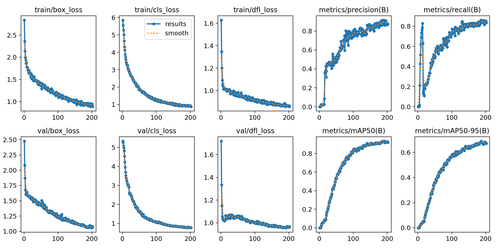
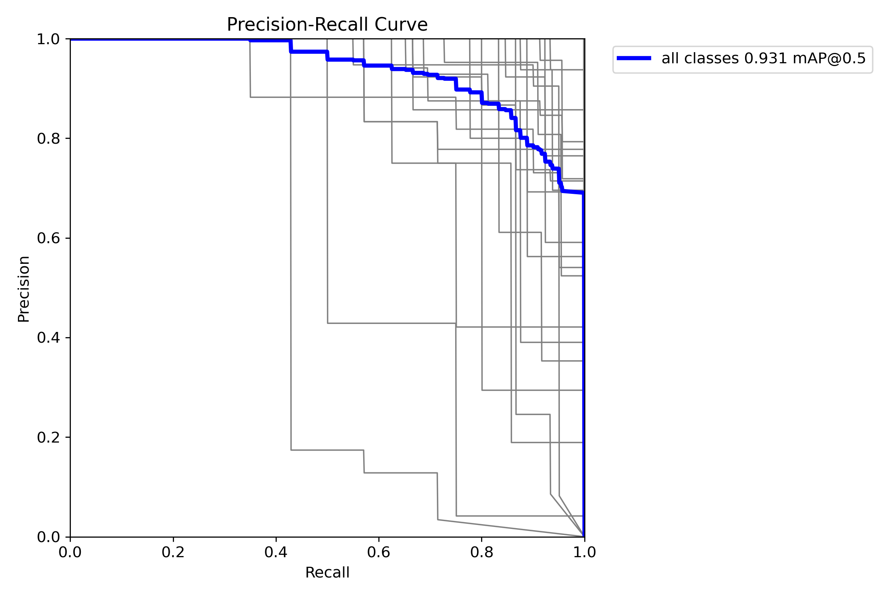
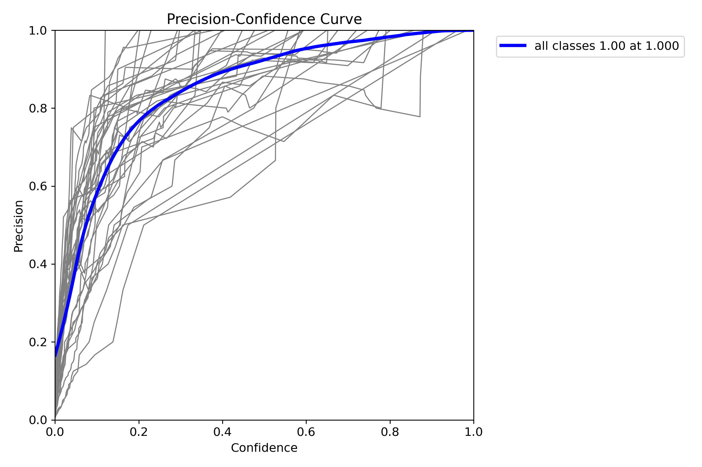
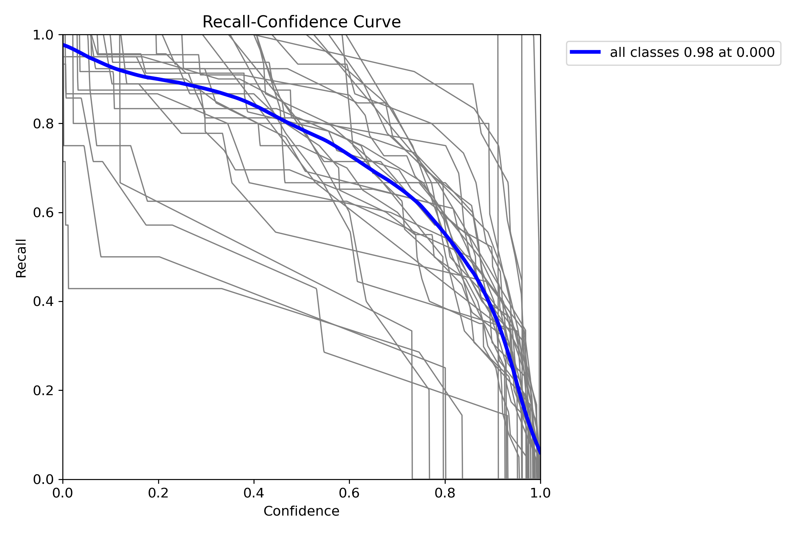
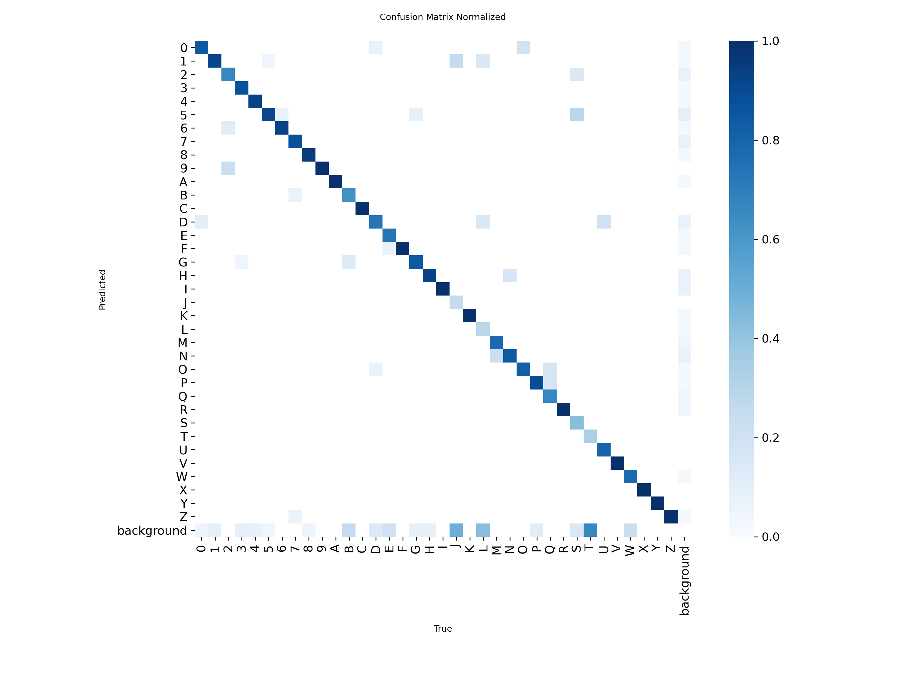
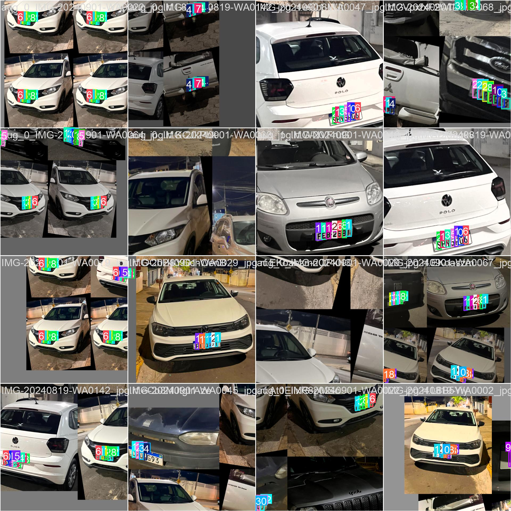
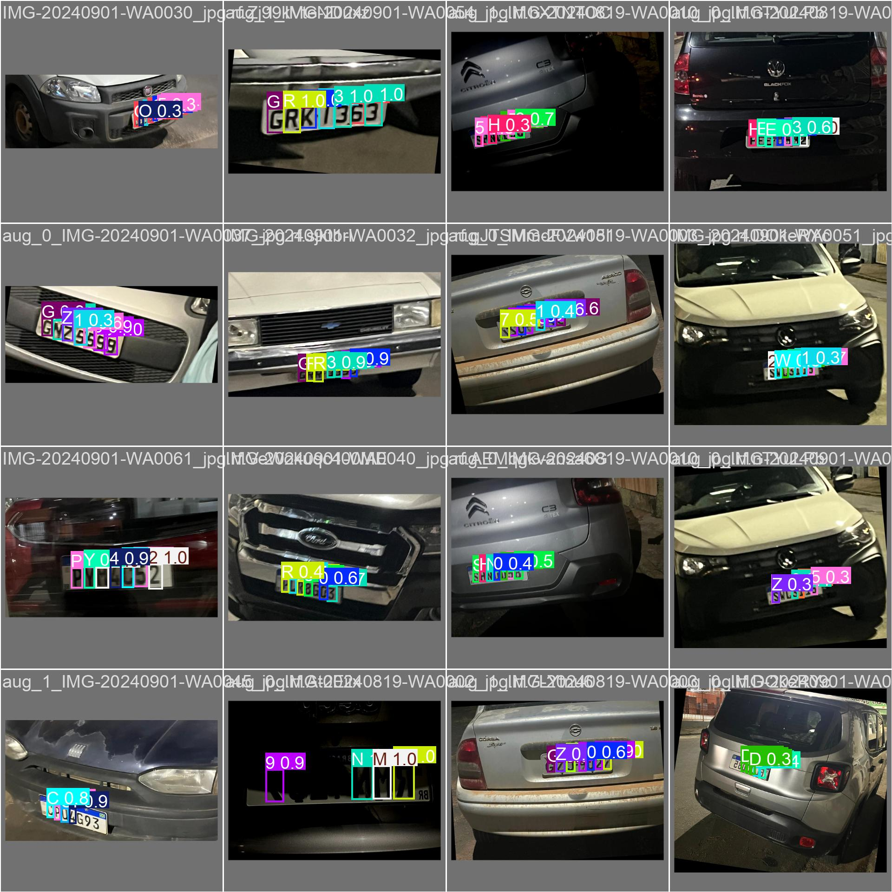
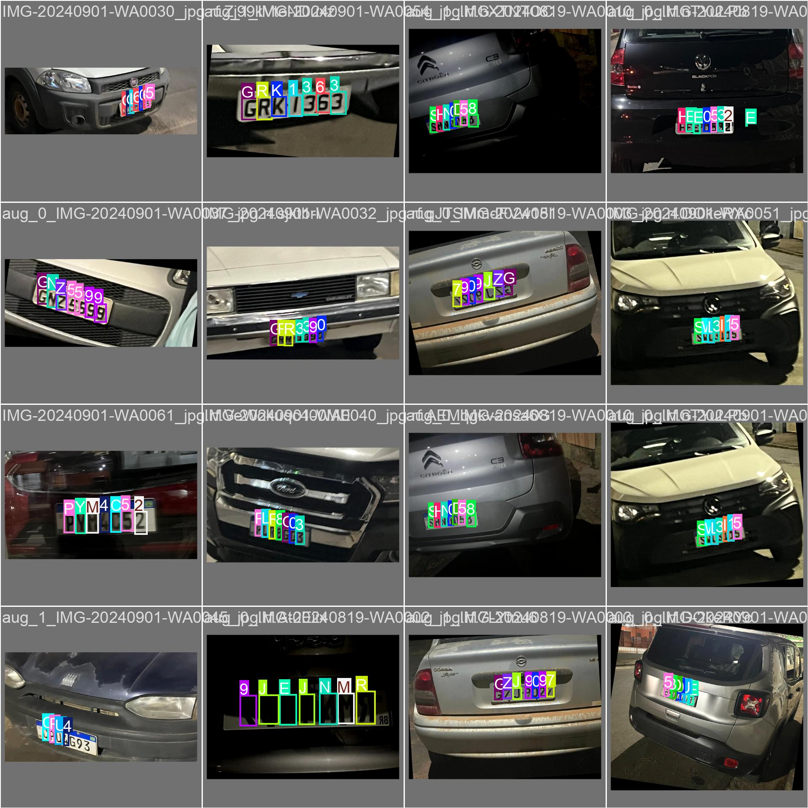
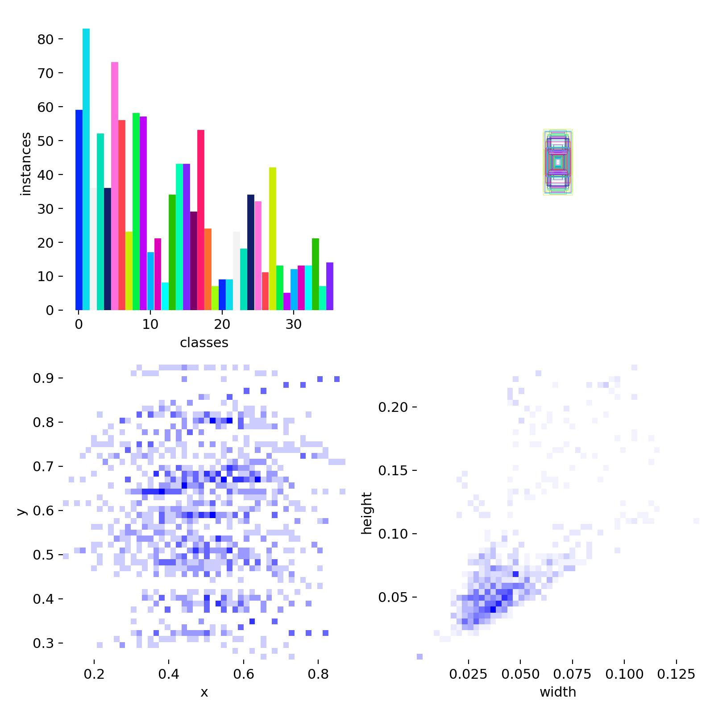

# Brazilian ALPR System

End-to-end **Automatic License Plate Recognition (ALPR)** research stack aimed at Brazilian plates under challenging conditions: low resolution, sensor noise, uneven lighting, and perspective variation. This repository bundles a **Roboflow-sourced character-level dataset** (digits and letters in YOLO format), a **Colab-oriented analysis and training notebook**, and **exported YOLOv8 training artifacts** including weights and diagnostic plots.

---

## Table of contents

- [Overview](#overview)
- [Repository layout](#repository-layout)
- [Dataset](#dataset)
- [Notebook: analysis and training](#notebook-analysis-and-training)
- [Model training](#model-training)
- [Results](#results)
- [Reproducing the pipeline](#reproducing-the-pipeline)
- [Limitations and next steps](#limitations-and-next-steps)

---

## Overview

| Component | Description |
| -------- | ----------- |
| **Detection target** | 36 classes: `0–9` and `A–Z` (per-character boxes, suitable for building plate strings after post-processing). |
| **Detector** | YOLOv8 **nano** (`yolov8n.pt`) via [Ultralytics](https://github.com/ultralytics/ultralytics). |
| **Notebook** | `Dataset_analysis_and_YOLO_Training.ipynb` — dataset inspection, class distribution, Albumentations augmentation, stratified split, training, packaging. |
| **Artifacts** | `license_plate_detection3/` — curves, confusion matrices, batch visualizations, `weights/best.pt`, `results.csv`, `args.yaml`. |

The high-level goal is a modular ALPR path: **localize characters** (this model) and, in a full system, combine with **plate detection**, **ordering**, and **Brazilian plate-format rules** (Mercosul vs legacy).

---

## Repository layout

```
brazilian-alpr-system/
├── Dataset_analysis_and_YOLO_Training.ipynb   # Main Colab workflow
├── dataset/
│   ├── data.yaml                              # Class names & path hints (see note below)
│   ├── README.roboflow.txt                    # Roboflow export metadata
│   └── train/                                 # images/ + labels/ (YOLO .txt)
├── license_plate_detection3/                  # Training run outputs
│   ├── weights/best.pt
│   ├── results.csv, args.yaml, results.png
│   ├── confusion_matrix*.png, Box*.png
│   └── train_batch*.jpg, val_batch*_*.jpg, labels.jpg
└── README.md
```

> **Path note:** `dataset/data.yaml` lists `train`, `val`, and `test` paths relative to a parent layout (`../train/images`, etc.). The copy in this repo currently includes the **`dataset/train/`** tree as exported; when you run the notebook, it builds `train` / `valid` / `test` folders and a Colab-local `data.yaml` aligned with YOLO training.

---

## Dataset

- **Source:** Exported from [Roboflow](https://roboflow.com) (see `dataset/README.roboflow.txt`).
- **Size:** **86** source images (per Roboflow README); labels are **YOLOv8** normalized boxes (`class cx cy w h`).
- **Classes:** `nc: 36` — alphanumeric set `0–9`, `A–Z` as defined in `dataset/data.yaml`.
- **Content:** Crops or scenes where **individual plate characters** are annotated (not a single “full plate” class), which matches a **character detector** stage in ALPR.

---

## Notebook: analysis and training

The notebook `Dataset_analysis_and_YOLO_Training.ipynb` is authored for **Google Colab** (GPU metadata: **T4**). It performs the following stages in order:

1. **Archive ingestion**  
   Unzips the Roboflow export (e.g. `license plate.yolov8.zip`) into a `train/images` and `train/labels` layout.

2. **Qualitative inspection**  
   Loads `data.yaml`, samples images, and displays them with **IPython** thumbnails while printing decoded label lines with **human-readable class names** from `names`.

3. **Exploratory analysis**  
   Aggregates YOLO labels across the corpus, builds a **per-class count** table with **pandas**, and visualizes the distribution with **matplotlib** / **seaborn** (bar plots for imbalance diagnostics).

4. **Augmentation (Albumentations)**  
   Installs `albumentations` and applies a **bbox-aware** pipeline on each image that has a matching label file:
   - `RandomBrightnessContrast` (p=0.5)
   - `HorizontalFlip` (p=0.5)
   - `Rotate` within ±15° (p=0.5)
   - `Blur` with `blur_limit=3` (p=0.3)  
   Originals are copied to `train_augmented/` plus **two stochastic variants** per image (`num_variants=2`), yielding on the order of **258** files in the augmented folder in the logged run (86 originals + 172 augmentations).

5. **Train / validation / test split**  
   Uses `sklearn.model_selection.train_test_split` with `random_state=42`:
   - **20%** held out as **test**
   - Remaining **80%** split again (**25%** of that slice → **validation**, i.e. **20%** of all images)  
   Effective ratio ≈ **60% / 20% / 20%** for train / val / test.

6. **Ultralytics training**  
   Installs `ultralytics`, loads `YOLO('yolov8n.pt')`, and calls `model.train(...)` with image size **640**, long schedule (**300** epochs), early stopping patience **15**, checkpointing every **10** epochs, and project directory under `/content/yolov8_training_results` (Colab). The run recorded in this repo’s `args.yaml` shows the saved run name **`license_plate_detection3`** (Ultralytics may increment names when folders exist).

7. **Artifact export**  
   Optional zipping of the results folder for download from Colab.

Together, these steps document a **repeatable experiment** from raw export to evaluated detector, with emphasis on **data understanding** before training.

---

## Model training

Key hyperparameters and settings (from the notebook and `license_plate_detection3/args.yaml`):

| Setting | Value |
| ------- | ----- |
| Model | `yolov8n.pt` |
| Task | `detect` |
| Epochs (max) | 300 |
| Image size | 640 |
| Batch size | 16 |
| Early stopping patience | 15 |
| Save period | every 10 epochs |
| AMP | enabled |
| Augmentation (Ultralytics defaults) | e.g. mosaic, HSV, translate, scale, fliplr, `auto_augment=randaugment`, `erasing=0.4`, etc. (see `args.yaml`) |

**Training outcome (logged run):** optimization **stopped early** after **202** completed epochs; the **best checkpoint** was retained at **epoch 187** (`best.pt`), per the notebook training log.

---

## Results

### Metrics at best epoch (epoch 187, from `results.csv`)

| Metric | Value |
| ------ | ----- |
| Precision (Box) | 0.884 |
| Recall (Box) | 0.857 |
| mAP@0.5 | 0.932 |
| mAP@0.5:0.95 | 0.690 |

> Values are read from the `metrics/*` columns on the row with `epoch=187` in `license_plate_detection3/results.csv`. Slight differences can occur if you retrain with another seed or data layout.

### Training curves



### Precision–recall and diagnostic curves

| PR curve | Precision curve | Recall curve |
| :------: | :-------------: | :----------: |
|  |  |  |

### Confusion matrix (normalized)



### Batch visualizations

| Training batch (mosaic) | Validation predictions |
| :---------------------: | :--------------------: |
|  |  |

| Validation labels (ground truth) | Label statistics |
| :------------------------------: | :--------------: |
|  |  |

Weights for the best run: `license_plate_detection3/weights/best.pt`.

---

## Reproducing the pipeline

1. **Environment:** Open `Dataset_analysis_and_YOLO_Training.ipynb` in **Google Colab** (GPU recommended) or a local Jupyter environment with CUDA if available.
2. **Dependencies:** The notebook installs `ultralytics`, `albumentations`, and uses `pandas`, `matplotlib`, `seaborn`, `opencv-python`, `scikit-learn`, and `PyYAML` as needed.
3. **Data:** Upload your Roboflow **YOLOv8** zip or point paths to this repo’s `dataset/train` structure; adjust `data.yaml` paths so `train`, `val`, and `test` match the folders created by the split step.
4. **Train:** Execute cells in order; training writes under the Colab project path unless you change `project=` / `name=` in `model.train(...)`.
5. **Evaluate:** Use `results.csv`, generated plots, and `yolo val` / Python API on `best.pt` for fresh metrics.

---

## Limitations and next steps

- **Scale:** ~86 source images is modest for 36 classes; performance may not generalize to all Brazilian road conditions without more data and domain diversity.
- **Task scope:** This detector targets **characters**, not full plates; a production ALPR stack still needs **plate localization**, **reading order**, and **format validation** (e.g. Mercosul vs older patterns).
- **Metadata mismatch:** Roboflow YAML may reference a workspace name that does not reflect the ALPR domain; rely on label semantics (`0–9`, `A–Z`) rather than workspace titles.
- **Suggested extensions:** plate-level detector + OCR fusion, hard-negative mining, night / rain subsets, and deployment export (TensorRT, ONNX) for edge devices.

---

## License and third-party data

Dataset licensing and redistribution terms are governed by your **Roboflow** project settings (see `dataset/README.roboflow.txt` and your Roboflow dashboard). Ultralytics YOLO models follow their respective licenses; consult the [Ultralytics documentation](https://docs.ultralytics.com) for commercial use.

If you use this repository in academic or technical work, please cite or acknowledge the **Roboflow** dataset export and the **Ultralytics YOLOv8** framework as appropriate.
